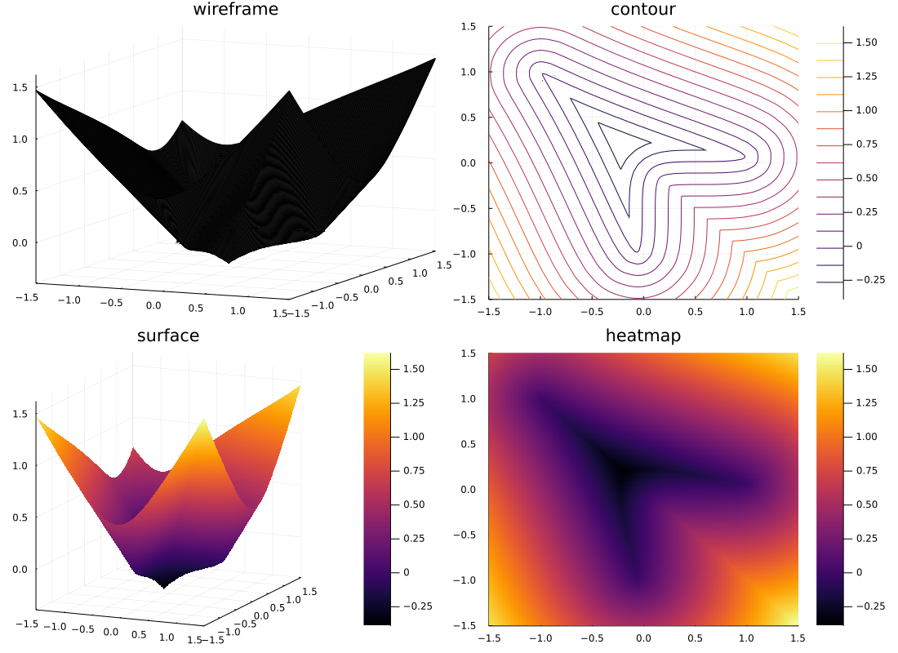
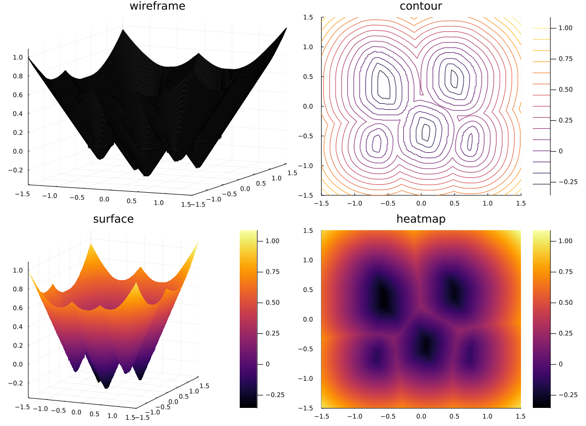

# The Signed distance function

SignedDistanceFunction.jl is a package to compute signed distance function.

Main features are:

- Creating a signed distance to compute the signed distance function of the jordan closed curve data set(2D).
- Creating a signed distance to compute the signed distance function of the multiple closed curve data set(2D).

<!-- レベルセット法のためのレベルセット関数を計算する際に初期値として必要な付合付き距離関数を閉曲線データから提供する。 -->

## Usage

The closed curve data must be `.csv` file.

`signedDistance2D("XXXXXX.csv", N)`

`signedDistance2D("XXXXXX.csv", N, "multi")`

## Contribution

### Setup

#### macOS

`$ make initial`

or

`$ julia>`  
`$ Pkg(1.5)> add PackageCompiler`  
`$ Pkg(1.5)> add DelimitedFiles`  
`$ Pkg(1.5)> add TimerOutputs`  
`$ Pkg(1.5)> add Test`  
`$ Pkg(1.5)> add Plots`  
`$ julia> using PackageCompiler`  
`$ julia> PackageCompiler.create_sysimage([:CSV, :DataFrames, :Plots, :Luxor, :BenchmarkTools, :TimerOutputs, :Test]; sysimage_path="Sysimage.so")`  
`$ Pkg(1.5)> activate .`  
`$ (SignedDistanceFunction)>`  
`$ julia> using SignedDistanceFunction`  
`$ julia> signedDistance2D("xxxxxx.csv", N)`  

### debug

`$ make test`
- Usecases is in `test/main.jl` !

`$ make test ARG=plot`
- Usecases is in `test/plot_for_debug.jl` !

`$ make bench`
- See `benchmarks.jl`.

`$ make runtest`
- Unit test on `unittest.sh`. TestCases is in `runtests.jl`.

#### Debug in REPL

`$julia>`

enter the Pgk mode(`]`)

`$ pkg>`

`$ pkg> activate .`

`(SignedDistanceFunction) pkg>`

return the REPL(`Delete/Backspace`)

`julia> `

`julia> using SignedDistanceFunction`

`julia> signedDistance2D("XXXXXX.csv", N)`

<!-- Plots sample data: 

`julia> using CSV, DataFrames, Plots, DelimitedFiles, Luxor, BenchmarkTools`

`julia> gamma = readdlm("data.csv", ',', Float64)`

`julia> plot(gamma[:, 1], gamma[:, 2], st=:scatter, title="infty_shape", markersize=2, grid=false)` 

`julia>  savefig("interface.png") -->
